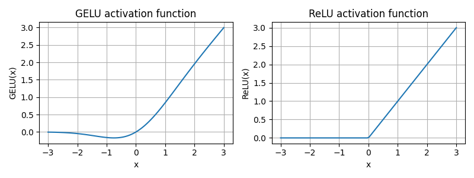

# Faithful Re-Implementation of GPT-2 From Scratch

A clean, educational PyTorch re-implementation of the core GPT-2 architecture built step by step from low-level components.

This project recreates the main moving pieces behind GPT-2 including token embeddings, positional embeddings, masked multi-head self-attention, transformer blocks, GELU feed-forward layers, autoregressive text generation, and a minimal training loop.

## Why This Repo?

This repo is for learning by building.

Instead of relying on a high-level trainer or a prebuilt transformer model, the implementation constructs GPT-2 from core PyTorch modules so you can inspect how each part works:

- Custom `MultiHeadAttention`
- Manual `LayerNorm`
- Custom `GELU`
- Full transformer block stack
- GPT-style causal masking
- Greedy autoregressive text generation
- Lightweight training and evaluation loop

## Model Overview

The default configuration mirrors the GPT-2 124M setup in structure:

| Component | Value |
| --- | --- |
| Vocabulary size | `50,257` |
| Context length | `1,024` |
| Embedding dimension | `768` |
| Attention heads | `12` |
| Transformer layers | `12` |
| Dropout | `0.1` |
| QKV bias | `False` |

Parameter counts from the included utility script:

- Total parameters in the current implementation: `163,009,536`
- GPT-2-style count if output weights were tied: `124,412,160`

## Project Structure

```text
.
├── GPT2.py                       # GPT-2 model definition
├── classes.py                    # Transformer blocks, LayerNorm, GELU, dataset class
├── services.py                   # Token helpers and greedy text generation
├── train.py                      # Dataloader creation, loss, evaluation, training loop
├── config.py                     # GPT-2 124M-style config
├── tokenizer.py                  # GPT-2 tokenizer setup with tiktoken
├── load_verdict.py               # Loads and splits the sample dataset
├── parameter_count.py            # Parameter counting helpers
├── Plot.py                       # GELU vs ReLU visualization
├── main.py                       # Training + generation entrypoint
├── Attentions/
│   ├── MultiHeadAttention.py     # Masked multi-head attention
│   ├── CausalAttention.py        # Simpler causal attention experiment
│   └── SelfAttention.py          # Early self-attention prototype
└── Dataset/
    └── the-verdict.txt           # Small text dataset used for experiments
```

## What’s Implemented

- GPT-style token + positional embeddings
- Causal masked multi-head self-attention
- Residual connections with pre-norm transformer blocks
- Feed-forward network with custom GELU activation
- Autoregressive next-token generation
- Training and validation loss tracking
- Small sample dataset pipeline using GPT-2 tokenization

## Quick Start

### 1. Install dependencies

```bash
pip install torch tiktoken matplotlib
```

### 2. Run the model

```bash
python main.py
```

### 3. Explore utilities

```bash
python parameter_count.py
python Plot.py
```

## Notes Before Running

- `main.py` currently sends the model to `cuda`, so a GPU-enabled PyTorch install is expected.
- If you want to run on CPU, replace `"cuda"` with `"cpu"` in `main.py` and the generation helper path.
- The model config uses a GPT-2-style `1,024` token context, but the current dataloader in `train.py` is set to `max_length=6` for lightweight experiments.
- The included dataset is intentionally small and mainly useful for validating the training pipeline and generation flow.
- Text generation is currently greedy decoding via `argmax`, which keeps the implementation simple and easy to follow.

## Sample Dataset

The repo includes `Dataset/the-verdict.txt`, which is loaded and split into train/validation text in `load_verdict.py`.

Current stats from the script:

- Characters: `20,479`
- Tokens: `5,145`

## Activation Visualization

The project also includes a small comparison plot between the custom GELU implementation and ReLU:



## Educational Focus

This codebase is best viewed as an implementation-first learning project:

- It favors readability over framework abstraction
- It shows how GPT-2 pieces fit together internally
- It is a strong base for experimenting with sampling, weight tying, checkpoint loading, and larger-scale training

## Good Next Steps

- Add top-k or temperature sampling
- Tie token embedding and output projection weights
- Save and load model checkpoints
- Add a `requirements.txt`
- Expand training to a larger corpus
- Add pretrained weight loading for direct GPT-2 comparisons

## Acknowledgments

- OpenAI's GPT-2 architecture
- PyTorch for the modeling stack
- `tiktoken` for GPT-2-compatible tokenization

---

If you are studying transformers and want to understand GPT-2 by rebuilding it piece by piece, this repo is a great starting point.
